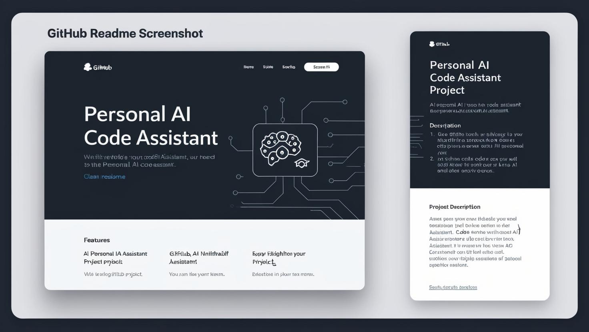

  
  
  
  
  
  

<h1 align="center">🧠 Code Companion</h1>

<strong>Personal AI Coder Agent</strong>

A powerful autonomous AI framework using <code>Ollama</code> and <code>CodeLlama:7B-Instruct</code> 
Built to plan, code, and improve real-world applications — starting with a Blog Platform (FastAPI + HTML + TailwindCSS).

---

<h3 align="center">🚀 Supercharge your coding with fully local, private, and open-source AI capabilities</h3>

---

## 🎯 Key Features

- **Autonomous Task Planning & Execution** — Just describe your goal, and the agent builds it.
- **AI Code Generation & Review** — Frontend, backend, logic... generated in seconds.
- **Self-Improving Critic & Feedback Loop** — Learns and optimizes your solution over time.
- **Real-time Web UI** — Built with HTML + TailwindCSS, shows live task status.
- **Downloadable Code Files** — Instantly grab your generated project files.
- **Live Code Validation** — Backend performs static checks via API endpoints.

---

## 📽️ Demo Preview

   
  <em>Click the image to watch the full demo</em>

---

## ⚠️ Performance Note

> If Code Companion responds slowly, it’s likely due to low system resources — not the codebase.

**Recommendations:**
- ✅ 16GB RAM minimum
- ✅ SSD storage
- ✅ Dedicated GPU (6GB+ VRAM preferred)

> Systems with less than 8GB RAM or no GPU may face slow or failed AI inference.

---

### 💡 Pro Tip:
If your system is high-end, unlock advanced performance using:

- `CodeLlama-13B-Instruct`
- `CodeLlama-34B-Instruct`
- `Deepseek-Coder-33B`
- `WizardCoder-33B-Instruct`

> 🧠 These offer results close to GPT-4.5 / Devin AI / Cursor AI — completely offline.

---

## 🛠️ Prerequisites

- Python `3.10.12`
- Node.js `20.18.0`
- Ollama with `codellama:7b-instruct`
- Git

---

## ⚙️ Setup Instructions

### 1. Clone the Repo

      git clone https://github.com/bhaktofmahakal/Code-Companion-personal-ai-coder-agent.git
      cd Code-Companion-personal-ai-coder-agent

Backend Setup (FastAPI)

      python -m venv venv
      source venv/bin/activate  # Windows: venv\Scripts\activate

Frontend Setup (html + TailwindCSS)

      Start Ollama
      ollama run codellama:7b-instruct

Start Backend API

    uvicorn backend.main:app --host 0.0.0.0 --port 8000

🧪 How It Works
      
      Sample Input : “Build a blog platform”
      
      The agent will:
      
      Plan tasks using prompts
      
      Generate and execute code
      
      Review and improve the solution
      
      Provide downloadable output

🧠 AI Code Companion – Main Capabilities

### Core Features
- **Code Generation**: Generate clean, well-documented code snippets based on your descriptions
- **Code Debugging**: Identify and fix issues in your code
- **Code Explanation**: Get detailed explanations of how code works

### Advanced Features (Inspired by Devin AI)
- **Code Analysis**: Analyze code structure and get insights about complexity and potential improvements
- **Test Generation**: Automatically generate unit tests for your code
- **Security Scanning**: Check your code for potential security vulnerabilities
- **Implementation Planning**: Break down complex coding tasks into manageable steps
- **Project Generation**: Create multi-file projects from a simple description
- **Code Sharing**: Share your code via unique URLs
- **Custom Templates**: Create and save your own prompt templates
- **Syntax Highlighting**: Format code with beautiful syntax highlighting
   
3. Select a mode (generate, debug, explain, etc.) and enter your request.

## API Endpoints

The application provides several API endpoints:

- `/generate_code`: Generate, debug, or explain code
- `/analyze_code`: Analyze code structure
- `/generate_tests`: Generate unit tests
- `/security_scan`: Scan code for security issues
- `/plan_implementation`: Break down complex tasks
- `/generate_project`: Create multi-file projects
- `/share_code`: Share code via unique URLs
- `/save_prompt_template`: Save custom prompt templates
- `/highlight_code`: Format code with syntax highlighting

## Project Structure

- `app.py`: Main FastAPI application
- `utils.py`: Utility functions for code analysis, test generation, etc.
- `static/`: Static files (HTML, CSS, JS)
- `Prompts/`: Prompt templates
- `shared_code/`: Shared code snippets
- `generated/`: Generated project files

## Technologies Used

- **Backend**: FastAPI, Python
- **Frontend**: HTML, CSS, JavaScript, TailwindCSS
- **AI**: Ollama, CodeLlama
- **Code Analysis**: Custom Python utilities

## Contributing

Contributions are welcome! Please feel free to submit a Pull Request.

Fork this repository

      Create your feature branch: git checkout -b my-feature
      
      Commit changes: git commit -m 'Add feature'
      
      Push to branch: git push origin my-feature
      
      Create a Pull Request

📜 License

    Licensed under the MIT License. See LICENSE for details.
 Acknowledgments
 
💡 Ollama – LLM orchestration engine

⚡ FastAPI – Async Python backend

🎨 TailwindCSS – Modern UI styling

💻 Inspired by: Devin AI, Ghostwriter, Cursor AI

